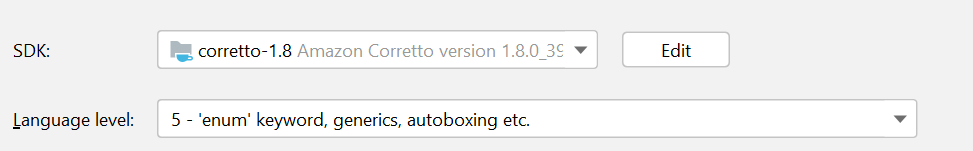

# EarthQuakeMap

### The project shows realtime earthquake on the map with detailed info about magnitude and location.

My EarthQuakeMap using PApplet and UnfoldingMap

## Compatible JDK version
### Strictly advise use JDK 1.8 with Language level 5 (as on the pic; in other case the project will not opening):

## Screenshots

